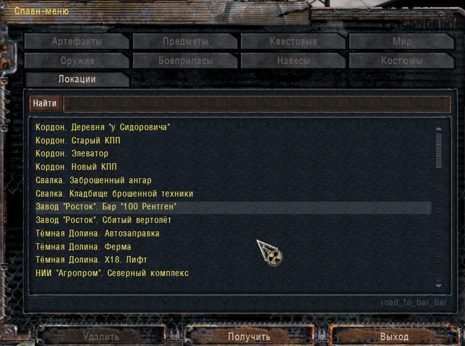

# Спавн-меню для Сталкер: Новый арсенал 7.0

Оригинальное спавн-меню, поставляемое с игрой, в которое добавлена новая закладка "Локации" для быстрого перехода на нужную карту.
Большинство переходов взяты из диалогов проводников, также в список добавлены новые точки телепортации и некоторые бывшие скрытыми.

**Переход в локацию раньше времени может сломать сюжет игры!** В первый раз заходите в локацию по сюжету, сами.  
Мод сделан в первую очередь для быстрого возврата назад или сдачи квестов.

### Установка
Скопировать папку `gamedata` в корневую папку с игрой:  
 - Если модов вы не ставили, то папки `gamedata` у вас не будет и переписывать поверх ничего не придётся.  
 - Если `gamedata` уже есть, и при копировании хотя бы 1 файл уже существует, то данный мод будет несовместим с уже установленными. 
   В этом случае возможно сличение одноимённых файлов и добавление отсутствующего, это только для знатоков.

### Запуск
В главном меню нажать INSERT.

### Файлы
кодировка файлов должна быть windows-1251
- `./gamedata/config/ui/ui_cheat_soc.xml` - интерфейс спавн-меню.
- `./gamedata/scripts/guide_manager.script` - функции по перемещению игрока по локациям
- `./gamedata/scripts/ui_cheat_soc.script` - функции спавн-меню
- `./gamedata/scripts/ui_main_menu.script` - функции главного меню, здесь можно заменить INSERT на F1 или другую кнопку

[Скачать Новый арсенал 7.0 и разные моды к нему можно здесь.](https://ap-pro.ru/forums/topic/1921-novyy-arsenal-7/)